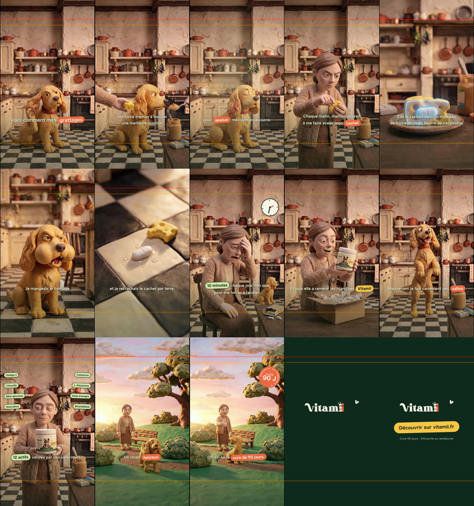
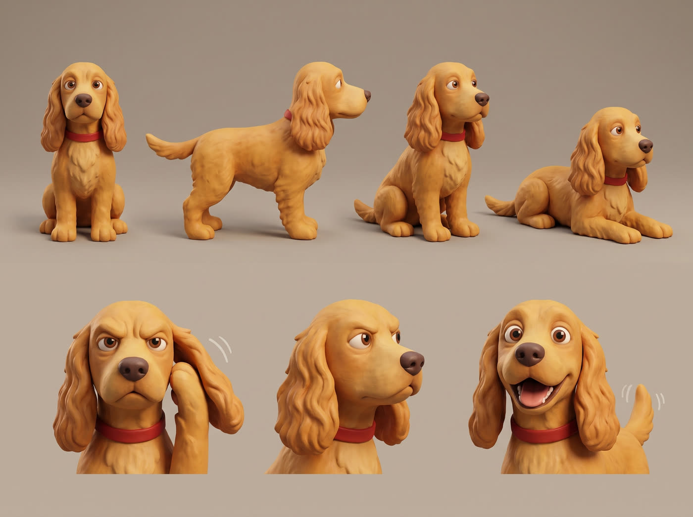
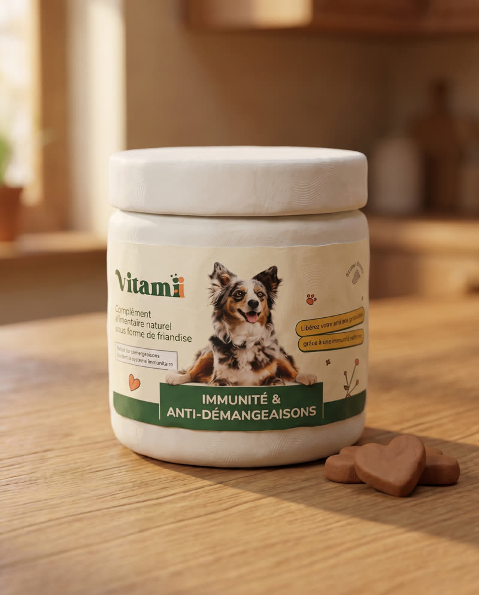
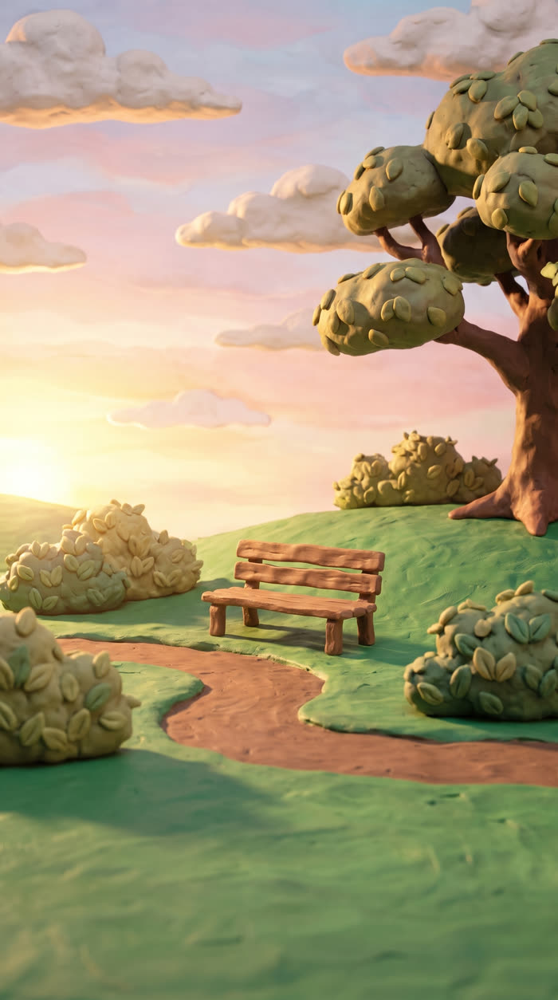

# Vitamii — reel « POV chien : cachet vs friandise »

`JJ_20260706_IMD_POVCACHET_V1` · publicité verticale en pâte à modeler (style Wallace & Gromit),
21 plans sur une voix off de 48,8 s. Produite de bout en bout : audit des b-rolls existants,
génération des plans manquants, montage, sound design et déclinaisons.

**Livrables** — `renders/` :

| Format | Fichier | Détail |
|---|---|---|
| 9:16 | `JJ_20260706_IMD_POVCACHET_V1_9x16.mp4` | 1080×1920 · 51,5 s · −15,0 dB mean / −0,8 peak *(non versionné, voir « Régénérer »)* |
| 4:5 | `JJ_20260706_IMD_POVCACHET_V1_4x5.mp4` | 1080×1350 · crop y=285 du master, overlays conçus pour y survivre |

---

## Le film

| Section | Slots | Contenu |
|---|---|---|
| Hook | 0,0 → 6,5 s | le cocker se gratte (patte arrière), les mains lui proposent fromage et beurre de cacahuète |
| Problème | 6,5 → 24,9 s | maman cache le cachet, radio bleue sur le fromage, refus, cachet recraché, 10 minutes perdues chaque jour |
| Solution | 24,9 → 33,5 s | le pot arrive, salto, friandise cœur engloutie |
| Preuve | 33,5 → 37,8 s | présentation produit + les 12 actifs qui apparaissent en cascade |
| Résolution | 37,8 → 45,6 s | fini les cachets à cacher, bascule parc au lever du soleil, câlin |
| CTA | 45,6 → 51,5 s | pouce levé, badge « Cure 90 J · Efficacité ou remboursé », end card |

Rythme : coupe médiane ~2,1 s, calé sur la référence client (pub Wuffes, médiane 2,5 s).



---

## L'univers visuel (canon)

La contrainte dure du brief : **mêmes décors, même chien, même maîtresse du début à la fin**.
Trois références ont été générées et verrouillées avant tout plan ; chaque plan part ensuite
d'une image fixe dérivée de ces références, puis est animé en image-to-video.

| Planche 360 du cocker | Pot Vitamii en clay | Décor parc |
|---|---|---|
|  |  |  |

Le décor cuisine et la maîtresse viennent des tests clay existants du client (cottage anglais,
mur chaux, cuivres, sol damier, cardigan beige) — c'est ce qui a permis de recycler deux plans
tels quels et de générer tout le reste dans la continuité.

---

## Pipeline

Basé sur le skill `montage-video-parlee`, variante « VO + b-rolls » (pas de talking head).

```bash
# 1 · Transcription mot-à-mot de la VO (la vérité du calage, jamais les timecodes du brief)
~/.claude/.venv/bin/python scripts/transcribe-qwenx.py sources/vo-povcachet.mp3
~/.claude/.venv/bin/python scripts/detect-silences.py sources/vo-povcachet.mp3

# 2 · Normalisation voix (le mixeur HyperFrames atténue ~3 dB → viser -14, pas -20)
ffmpeg -i sources/vo-povcachet.mp3 -af "loudnorm=I=-14:TP=-1.2:LRA=11" sources/vo-loud.m4a

# 3 · Assemblage b-roll frame-exact (22 slots → broll.mp4, 51,500 s pile)
~/.claude/.venv/bin/python scripts/build-broll-cachet.py

# 4 · Sound design : SFX calés sur les cues d'animation, puis mix + ducking
~/.claude/.venv/bin/python scripts/build-sfx.py
~/.claude/.venv/bin/python scripts/build-soundtrack-final.py

# 5 · Rendu
npx hyperframes lint
npx hyperframes render . -o renders/final.mp4 -q high -f 30 -w 2
ffmpeg -i renders/final.mp4 -vf "crop=1080:1350:0:285" -crf 18 -c:a copy renders/..._4x5.mp4
```

### Fichiers qui pilotent le montage

| Fichier | Rôle |
|---|---|
| `segments-timing.json` | les 22 slots : source, in/out, offset, effet d'entrée, et **pourquoi** |
| `captions.js` | sous-titres en phrases entières (consigne CDC : public âgé, pas de mot-à-mot) |
| `index.html` | composition HyperFrames : captions, horloge, 12 actifs, badge, end card |
| `scripts/build-broll-cachet.py` | découpe frame-exacte, Ken Burns, stretch, light-leak / whip-zoom |
| `scripts/build-sfx.py` | 25 cues SFX, chacune commentée par ce qu'on voit à cet instant |
| `plan-de-production.md` | journal complet : contraintes, audit, prompts, arbitrages, coûts |

---

## Décisions de montage notables

- **Frontière 03→04 déplacée à 7,30 s** pour que le clip recyclé (3,04 s) remplisse son slot
  sans ralenti — un décalage de frontière coûte moins cher qu'un stretch visible.
- **Plans 18-19 fusionnés en un seul trot continu** au parc (même source, offset = durée du
  slot précédent → raccord frame à frame). Corrige les clips « gamelle » où le chien
  apparaissait perché sur le plan de travail ; structure identique à la référence Wuffes,
  qui joue aussi son « no more messy floors » sur le parc.
- **Glow céleri sur le plan 3** : la source ne faisait pas disparaître les rougeurs comme
  demandé, l'habillage le fait à sa place.
- **Overlays tous placés à y ≥ 340** pour survivre au crop 4:5 (fenêtre 285 → 1635).
- **Pas de master audio post-rendu** : contrairement au reel précédent, le rendu sort déjà
  à −15,0 dB mean. Un `volume+alimiter` supplémentaire clippait à 0 dB.

---

## Coût de génération

110 crédits Higgsfield au total (≈ 5-7 $ en recharge, ≈ 1/10 d'un mois Plus) :

| Poste | Détail | Crédits |
|---|---|---|
| Images | 18 visuels Nano Banana 2K (références + start frames) × 2 | 36 |
| Vidéos | 18 clips Veo 3.1 Lite 4 s 9:16 × 4 (pilote et 1 retry inclus) | 72 |

Les alternatives mesurées, pour arbitrer les prochains projets : Kling 3.0 Turbo 7,5 cr/clip
(~170 cr le film), Seedance Mini 12,5 cr, Seedance 2.5 32,5 cr (~620 cr). Sur des plans de
1 à 4 s qui se trimment, Veo Lite suffit largement.

---

## Régénérer ce qui n'est pas versionné

Le dépôt contient tout le pipeline et les 18 b-rolls générés, mais pas les intermédiaires
lourds (543 Mo sur disque → ~47 Mo ici). Pour retrouver un projet complet :

```bash
# le master 9:16 et la timeline assemblée (~2 min)
~/.claude/.venv/bin/python scripts/build-broll-cachet.py
npx hyperframes render . -o renders/final.mp4 -q high -f 30 -w 2

# la librairie SFX (licence Mixkit : usage libre, redistribution interdite)
ln -s ~/.claude/skills/montage-video-parlee/assets/sfx-library sfx/library
```

La musique et la vidéo d'inspiration se retéléchargent depuis le brief client ;
les b-rolls candidats non retenus, depuis le Drive (identifiants dans
`refs/brolls-drive-listing.json`).
